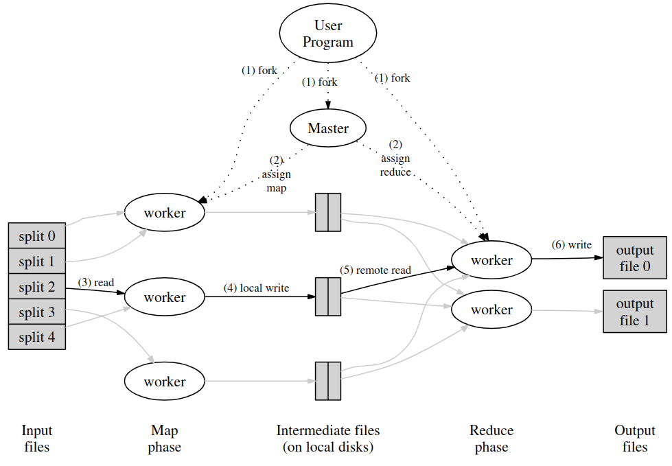

---
aliases:
  - MapReduce
recurso: "[[../facultad/Sistemas Distribuidos I/recursos/02-mapreduce-osdi04.pdf|02-mapreduce-osdi04]]"
cover: ""
---
# Map Reduce
- Se quiere dividir un proceso de mucho cómputo entre muchos CPUs.

## Proceso
1. Se toman los archivos de inputs para MR, y los va a tomar un worker de mapper.
2. El mapper emite archivos intermedios, los cuales son key-value.
3. El reduce toma de inputs a los archivos intermedios, y agrupa por key para tomar jobs.
4. El reduce emite en los archivos finales sus resultados.