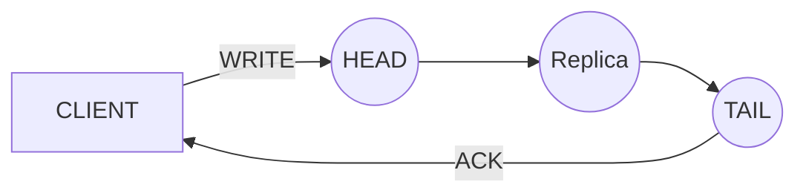

---
aliases:
  - Replicación y Sharding
---
# Sistemas de Storage Distribuidos
- e.g. FS, DBs.
- Se busca construir sistemas escalables y tolerantes a fallas.
	- También se puede buscar tener data geográficamente cerca de los usuarios (reduce latencia)

## Leaders y Followers

- Una réplica es un nodo que se encarga de persistir una copia de la DB
- Las escrituras pasan por el leader, y este se encarga de replicar su log a los followers 
	- Esto tiene como ventaja de que podemos leer de cualquiera de los nodos (sea o no leader).

## Sharding / Partición
- La idea es particionar los datos en distintos chunks, y mandar cada chunk a máquinas distintas.
- Hay que mantener un mecanismo de nombres
	- Cada dato/registro debe estar mapeado a una ubicación física en alguna máquina.
- Beneficios:
	- Se gana escalabilidad horizontal. 
	- También se mantienen fallas parciales: si una máquina falla, como las demás mantienen otros datos, el sistema sigue up (Tolerancia a Fallas).
	- Paralelismo de acceso -> Performance.

---
## Replicación
- Consiste en replicar los datos completos en varias máquinas.
- Si se muere alguna de las máquinas, las demás deberían de tener la data actualizada (Tolerancia a Fallas).

### Mecanismos de Replicación
1. State Transfer / Snapshots
	- La idea es tomar una "foto" de una máquina, y transferirla a otra.
	- Puede ser lento, pero es sencillo.
2. Replicated State Machine
	- Si enviamos una tira de operaciones a varias máquinas en el mismo orden, y partiendo del mismo estado inicial, y asegurándonos determinismo estricto -> El estado en las máquinas es el mismo (van a estar sincronizadas).
	- Garantizar el orden de las operaciones es un problema de consenso.

> [!NOTE] Log
> Es una estructura que tiene las operaciones que le van llegando a un nodo.
> - Relaciona las operaciones con un orden específico.
> - Solo se pueden appendear operaciones.
> > [!QUOTE] El log es el dual de la DB.

### Primary Backup (Master-Slave)
- Se tiene una máquina Primary, a la cual le llegan las operaciones de escrituras. Esta máquina a su vez va "backupeando" la data a las demás máquinas (Secondaries).
- El chiste es que las lecturas pueden ir a parar a los secondaries para alivianar al primary y aprovechar al máximo la capacidad de cada máquina.
- El primary determina el orden unilateralmente (aplica localmente las operaciones, y eventualmente las emite a las réplicas). -> Esto en consecuencia hace que se tenga [Consistencia Eventual](06-linealizabilidad.md#Consistencia%20Eventual).

#### Chain Replication
- La idea central es encadenar las distintas máquinas, e ir replicando el log en el orden de la cadena
	- El head es el primer nodo, y el tail el último.
	- El cliente le pega al head, y responde el tail -> Una RPC no serviría para esto.
	- El head manda menos datos porque solo se comunica con un nodo.
	- Es fuertemente consistente -> La escritura está segura una vez que conseguimos el ACK del tail, y se lee del tail (en el caso básico del algoritmo).

##### Fallas posibles
1. Si falla el Head, se promueve el siguiente nodo siguiente al mismo como nuevo Head, y se "avisa/reconfigura" a los clientes del sistema.
	- Si un cliente justo mandó un dato, y posteriormente el head se murió, puede pasar de que el dato pase la cadena y reciba el ACK, pero eventualmente el cliente va a detectar un fail-stop (por ejemplo, tiene un timeout), y ahí considera que el dato se perdió (podría llegar a reintentar).
2. Si falla el tail, se reasigna al anterior nodo al tail como nuevo tail, y se "reconfigura" el/los cliente/s.
3. Si falla otro nodo, se suele "bypassear" al nodo que falló. 
	- Puede pasar que el nodo siguiente al que falló quede desactualizado porque se cortó la cadena, entonces la idea ahí es poder actualizarlo eventualmente (es decir, enviar la data que le falte)
