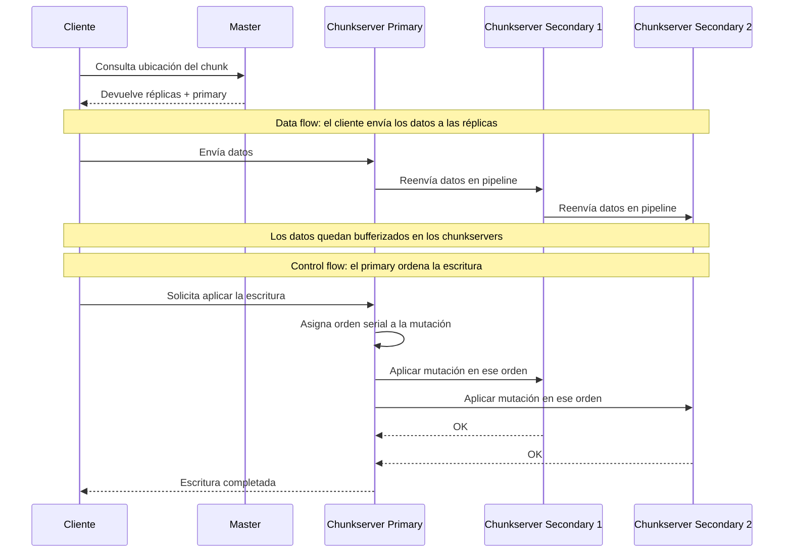

---
aliases:
  - Google File System
recurso: "[[recursos/02-google-file-system.pdf|02-google-file-system]]"
---
# Google File System (GFS)
- Surge de las crecientes necesidades de procesamiento de data que tuvo Google en los 00's.
- [MapReduce](02-map-reduce.md) y este FS surgen en la misma época, y MR hacía uso de este FS como sistema de archivos compartido entre las máquinas.

## Requisitos que tenía Google
- Global para todas las máquinas (es una abstracción).
- Escalable -> Se manejaban archivos grandes.
- Tolerancia a Fallas.
	- Se tiene que monitorear constantemente y detectar las caídas de los servers, como así también recomponerse eficientemente.
- Uso de Commodity hardware.
	- La falla aquí es la norma. No se depende de unidades de cómputo grandes ni confiables en que anden siempre.
- Orientado a Batch -> Procesos grandes que toma un gran input de datos e ir consolidándolos por ejemplo.
	- Solían llegarles archivos del orden de los GBs.
	- No les salía rentable particionar los archivos en bloques de tamaños convencionales, y manejaban bloques muy grandes para el estándar (del orden de los MB).
- En general necesitaban algo muy simple, por lo que relajaron la consistencia del FS.

> [!NOTE] File
> Se manejan de forma similar que los files de Unix.
> - Se parten en chunks de 64MB (tamaño fijo)
> - Los chunks tienen un identificador único e inmutable de 64 bits (*chunkhandle*) -> Se setea al momento de crearse. 

## Arquitectura

- Master (Coordinador): es único (simplifica mucho el diseño), y tiene la estructura del FS, y mantiene en dónde se tiene cada chunk (**Metadata**).
	- Servicio de namespaces
	- Mapping de archivos a chunks, y locations de las réplicas de los chunks.
	- Elegir líder / Primary (qué chunkserver va a guardar cada chunk).
	- Monitor/Detección de fallas
		- Envía HeartBeats a los chunkservers para monitorear sus status.
	- El manejar chunks tan grandes reduce la cantidad de metadata que tiene que guardar el master, por lo que al final de cuentas, era capaz de mantener el mapping de chunks en memoria.
- Chunkservers: Interactúan con los clientes y con el master
	- Guardan los chunks en sus discos como si fueran archivos de Linux.
	- Un mismo chunk se suele replicar en varios chunkservers (por default, en 3 réplicas).
- Client: Tiene más responsabilidad
	- No suele cachear la data en sí, esto fue una decisión para simplificar las cosas. Los chunkservers tampoco cachean, ya que suelen tener una respuesta rápida a las requests (el FS de Linux es muy eficiente).
	- Además, sabe calcular la posición sobre la cual va a pedir la lectura (es decir, calcula el offset que quiere del file).
	- Se busca reducir al máximo las interacciones client-master, ya que como el último es único, se convertiría en un bottleneck. 
		- En un mismo request se puede pedir la ubicación de varios chunks al master (se pide un "batch" de chunks en un solo request en lugar de mandarle muchos requests separados).
		- También se aprovecha el cache de esas ubicaciones que responde el master en el mismo cliente, de forma tal de reducir las futuras req al master.

### Metadata del master
- Toda la metadata se mantiene cargada en la memoria del master
	- Esto hace que el master sea mucho más rápido para responder
	- pero el sistema queda completamente limitado a cuánta memoria tiene el master -> No es tanto problema, porque se escala fácilmente, además de que al mantener un tamaño de chunk de 64MB, se simplifica mucho el tamaño total que el master tiene que mantener cargado en memoria.
- Las locations de los chunks no las tiene guardadas persistentemente
	- De manera rutinaria envía los HeartBeats a los chunkservers para verificar si están vivos, y también para consultar los chunks que tienen guardados.
	- Simplifica mucho la implementación, ya que el chunkserver tiene la palabra final para decir si tiene un chunk o no (y el master no tiene esa responsabilidad de sincronizarse 24/7 con los chunkservers, que fallan muy a menudo).
- Se mantiene un log de las operaciones que se hizo en el GFS
	- Nos permite reestablecer el master en caso de una caída
	- Se guarda persistentemente en varias máquinas, y se bloquean las respuestas a los clientes hasta que el log sea consistente.
	- Se van tomando checkpoints del log, cosa de mantenerlo corto y hacer más rápido el startup.
		- El master suele hacer esa rutina del checkpoint en el background, cosa de no retrasar el funcionamiento de las incoming requests.

---

## Primary Backup
- Al llegar un Write, el coordinador resuelve a qué chunkservers escribir
	- Entre esos servers, decide quién es el "líder" (Primary), y quienes son los "followers" (Secondary). 
	- Va a ir monitoreando mediante HeartBeats el estado de esos servers.
	- Cada chunk está dentro de 3 réplicas (replica group), y distintos chunks de un mismo archivo pueden estar desparramados en distintos replica groups.

### Manejo de errores
- Si un Append falla cuando el P le escribe a algún S, se le devuelve un error al cliente, y la idea es que reintente. Suelen quedar huecos en los offsets al haber esto tipo de errores: se los llama padding (son regiones inconsistentes).
- El cliente resuelve el problema de inconsistencias.
	- Duplicados: Usa Unique IDs para cada registro que vió.
	- Padding: Uso de checksums para validar si algún registro que está leyendo es basura (detección de huecos). 

### Uso en [MapReduce](02-map-reduce.md)
- En los mismos hosts físicos se colocaban workers de MR y chunkservers del GFS.
	- Se manejaba una estrategia para asignar mappers en hosts que también corrían el chunkserver con los archivos que necesitaba para reducir latencia.
	- Cada chunk es un slice que alimenta a los workers de MR.
	- Las apps tenían una forma de detectar cuáles eran los chunkservers más cercanos que contenían la data que necesitaban, por lo que se optimizaba aún más el envío de packets en la red.

## Coordinador
- Es único -> Único punto de falla.
- Estructuras en memoria (Poco escalable).
- Log + Snapshots
- Mapeo de filenames a chunkhandles (identificadores de chunks). Mapeo de chunkhandles a chunkservers.
- Versionado de chunkhandles (sirve para manejar primaries y secondaries de los distintos chunks).

> [!NOTE] Lease
> Permisos para ser primary (duran 60s en GFS) 
> - El primary deja de serlo cuando se vence el lease, pero puede renovar.
