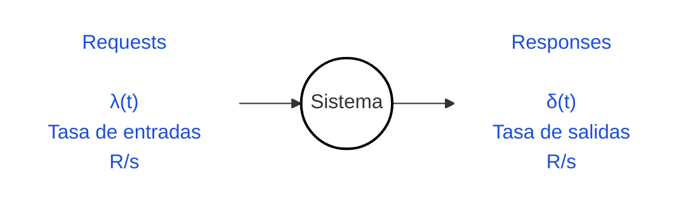
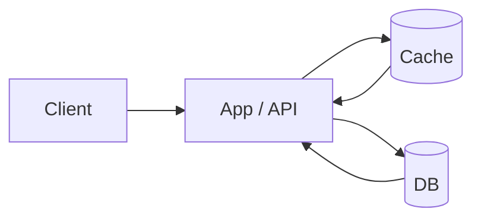
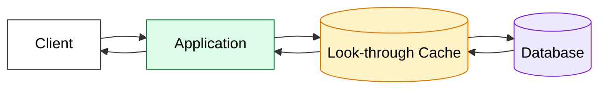
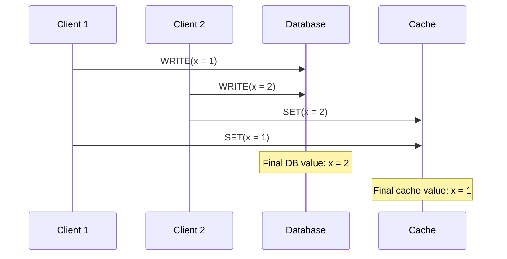

---
aliases:
  - Consistencia en caches
recurso: "[[recursos/05-memcache-fb.pdf|05-memcache-fb]]"
---
# Teoría de Colas
- Sea $N(t)$ la función que modela la cantidad de requests en el sistema.


- Si $λ(t) > δ(t)$, el sistema va a empezar a encolar requests.
	- $\frac{dN(t)}{dt} = \lambda(t) - S(t)$


> [!NOTE] Ley de Little
> Sirve para modelar cuántas requests en promedio va a tener un sistema.
> $L = \lambda W$
> - $L$ = clientes en el sistema en promedio
> - $\lambda$ = tasa de arribo -> **Throughput** del sistema
> - $W$ = tiempo de respuesta del sistema


- La Base de Datos de un sistema normalmente tiene un parámetro que indica la cantidad máxima de conexiones activas que puede tener `MAX_CONNECTIONS` (típicamente es fijo).
	- Como es número es fijo, y se suele tener un promedio del tiempo de respuesta a las request que le llega, podemos calcular el throughput máximo que se puede bancar.
- Por ley de Little, para aumentar $\lambda$ hay que aumentar el $L$ (cantidad de conexiones que me puedo bancar), o disminuir el $W$ (el tiempo de respuesta a las requests). ****
---
# Caches
- Lo más importante no es meter el cache para reducir el tiempo de rta que percibe el usuario, sino también para aumentar el throughput del sistema en general, ya que estamos bajando el tiempo de respuesta.
- También bajamos drásticamente la carga sobre la DB (si se tiene un buen Hit Ratio al cache)
- Normalmente los usamos para reducir el $W$ (tiempo de rta)
	- Son hashmaps Key-Value que se mantienen en memoria, y que por ende son rápidos.
- Operaciones:
	- `Get(key)`
	- `Store(Key, Value)`

## Look Aside Cache



1. Llega una petición al sistema
2. Se fija si lo que se pide está en el cache
3. Si está cacheado, directamente el cache devuelve el dato
4. Si no está, se va a buscar a la fuente de verdad (Base de Datos)
	4.5. Se guarda ese valor en el cache.

## Look Through Cache



1. El cliente hace una request a la aplicación.
2. La aplicación le pide el dato a la cache.
3. Si el dato está en cache, ocurre un cache hit:
	   - La cache devuelve el dato.
	   - La aplicación responde rápido al cliente.
	   - No hace falta consultar la base de datos.
4. Si el dato no está en cache, ocurre un cache miss:
	   - La cache consulta la base de datos.
	   - La base de datos devuelve el dato.
	   - La cache guarda ese dato.
	   - Luego se lo devuelve a la aplicación.
5. En próximas requests, si se pide el mismo dato, la cache ya lo tiene y puede responder sin ir a la base.

---
# Memcache

1. Flujo básico de una Lectura de un objeto con clave `K`:

``` python
V = GET(K)
if V is NULL:
	V = fetch_db(...)
	SET(K, V)
return V
```

2. Flujo básico de una Escritura de un objeto con clave `K`:

``` python
write_db(...)
DELETE(K) # invalidacion de cache
```

## Invalidation Cross Region
- Se tiene un componente extra llamado mcsqueal, que se encarga de monitorear cambios en la DB de la region. 
	- Al detectar un write en la DB, se encarga del borrado de la key en la cache de esa misma region.

## Race Conditions
1. ¿Por qué no seteamos el valor en el cache luego de hacer una escritura?



- Usamos DELETE porque es idempotente: no nos importa el orden porque al final del día el resultado va a ser el mismo

2. Se puede dar el caso en el cual leamos una K que en realidad está siendo modificada, y por ende leemos algo "viejo"
