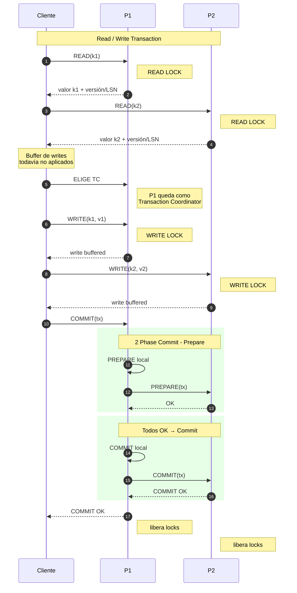
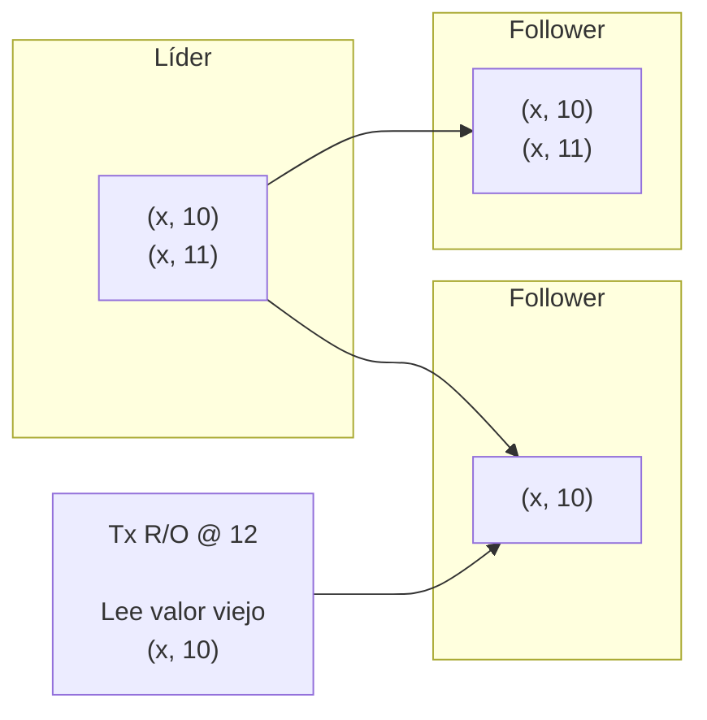

---
aliases:
  - Spanner
---
# Spanner
- DB distribuida que soporta transacciones (ACID).
- Se tienen tablas shardeadas por rangos de PKs.
	- Los shards se replican y están en distintos datacenters. -> Parecido a lo que hace [DynamoDB](10-dynamodb.md).
	- Usa MultiPaxos.

# Transacciones
- Read/Write $T_X$ -> Usan 2PC + 2PL (Locking pesimista) + Paxos groups
- Read Only $T_X$  -> Sin Locks (usan MVCC). -> Snapshot Isolation, True Time

## Read/Write $T_X$ 
- Al arrancar, el cliente elige a uno de los participantes ($P_i$, que son los grupos de replicación de los shards) como Transaction Coordinator (TC).

- 2PL garantiza serializabilidad
- Lento -> 10 - 100ms de tiempos de ejecución -> No importa tanto porque este tipo de transacciones son minoría.

---
## Read Only $T_X$
- Representan el 99.9% de las transacciones.
- La baja latencia se logra en parte leyendo de réplicas locales (Snapshot Isolation).
	- Tampoco lockean -> No hay 2PL
- Correctitud (External Consistency): La transacción tiene que ver a aquellas transacciones que commitearon en el pasado
	- La transacciones son serializables.
	- [Linealizabilidad](06-linealizabilidad.md)

### Multi-Version Concurrency Control (MVCC)
- Guardamos varias versiones del registro

| (k, ts) | V  |
|---------|----|
| (x, 10) | v1 |
| (y, 9)  | v2 |
| (y, 12) | v3 |
- Si llega una $T_{X, \, R/O} \, @11$:
	- $R_X=10$
	- $R_Y=9$

---
## Réplicas desactualizadas
- Si tengo un grupo de réplicas, puede llegar a pasar de tener alguna de ellas desactualizadas temporalmente, y puede pasar que una transacción caiga a leer valores a esa réplica, y obtendría un valor desactualizado (violando linealizabilidad)

### Safe Time
- Las réplicas guardan el timestamp más actualizado que tienen
	- Al llegar una transacción pidiendo algo con timestamp más grande que el que tiene la réplica, espera a tener un timestamp mayor al que pide la transacción
		- De esta forma no vamos a darle cosas del pasado 

---
## Lector Atrasado
- Va a leer cosas del pasado
	- Esto es inconsistente (NO linealizable)
- Hay que sincronizar relojes de alguna forma

### True Time
- True Time (`TT`) es un TDA que representa a un intervalo
	- `[earliest, latest]` -> Intervalo de Confianza
	- `TT.now()` nos devuelve el intervalo
	- `TT.after(t)` -> true si ya pasó `t`.
	- `TT.before(t)` -> true si `t` es anterior.

### Elegir el Timestamp de la $T_X$ de Lecturas a partir de `[Earliest, Latest]`

- Si elegimos a 9 como el timestamp de $T_2$, vamos a estar ocultando la $T_1$ (porque $T_1$ tiene timestamp 10)
	- Entonces elegimos siempre `tt.now().latest`

### Elegir el Timestamp de la $T_X$ de Escrituras a partir de `[Earliest, Latest]`

- En este caso, la escritura no puede tomar como timestamp a 12 (latest), porque sino estaríamos ocultando en $T_2$ cosas del pasado.
- Si tomamos el timestamp de la escritura en 9 (osea, en el pasado), corremos el riesgo de reescribir la historia

#### Reglas para solucionar el problema
1. Start Rule -> Tomar `tt.now()latest` cuando arranca el commit de la transacción -> Ese va a ser el TS de la transacción
2. Commit Wait -> Esperar a que TS pase luego de `now()`

